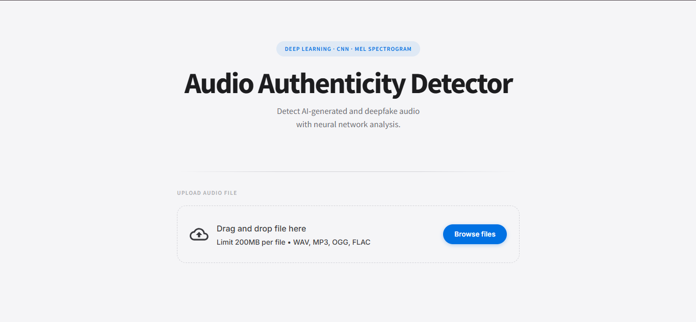
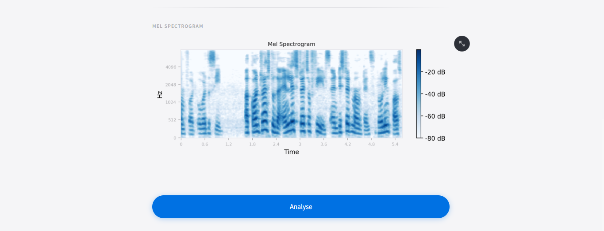
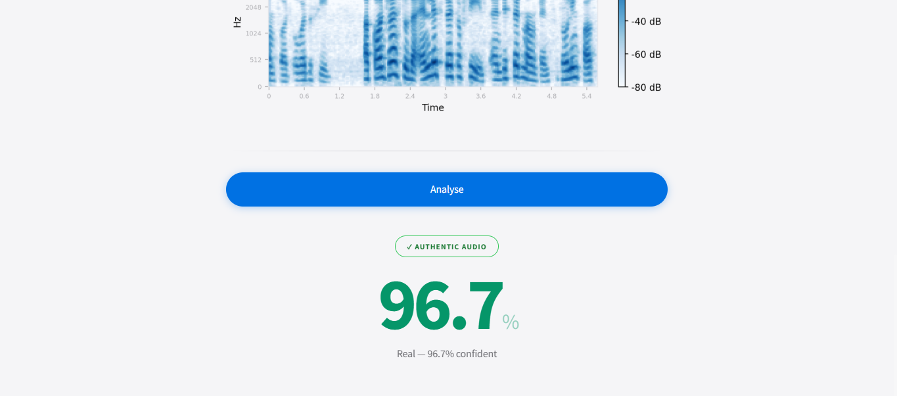
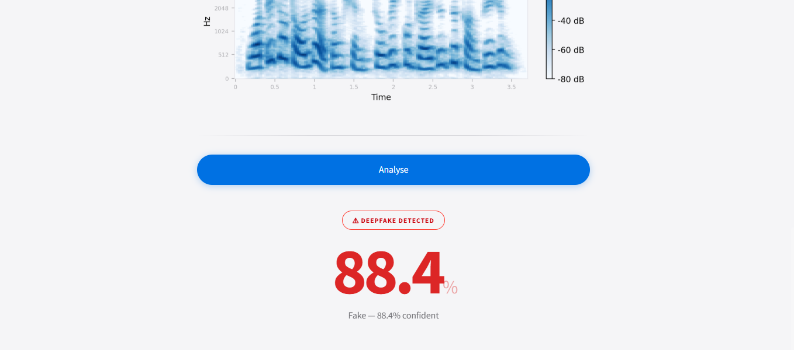

# DeepFake Audio Authenticity Detector

An AI-powered web application that analyzes an uploaded audio file and predicts whether the audio is **Real** or **DeepFake** using a trained deep learning model.

The application is built with **Python, TensorFlow, Librosa, NumPy, and Streamlit** and provides a simple interface for uploading audio and viewing the prediction result.

## 🚀 Live Demo

**Live Application:** https://deepfake-audio-authenticity-detector.onrender.com/

> The application may take some time to respond when it has been inactive because the deployment uses a free hosting environment. The first request after inactivity can take longer than subsequent requests.

---

## 📸 User Interface









The application provides a simple interface where users can upload an audio file and analyze its authenticity.

---

## ✨ Features

* Upload an audio file for analysis
* Audio preprocessing using Librosa
* Mel-spectrogram based feature extraction
* Deep learning based audio classification
* Predicts:

  * **Real Audio**
  * **Fake Audio**
* Displays prediction confidence
* Simple and user-friendly Streamlit interface
* Publicly accessible web application

---

## 🧠 How It Works

The application follows the following pipeline:

```text
Audio File
    ↓
Audio Preprocessing
    ↓
Mel-Spectrogram Generation
    ↓
Normalization
    ↓
Resize to Model Input
    ↓
Deep Learning Model
    ↓
Prediction
    ↓
Real / DeepFake
```

### 1. Audio Upload

The user uploads an audio file through the Streamlit interface.

### 2. Audio Processing

The uploaded audio is loaded and processed using **Librosa**.

The application extracts audio characteristics and converts the waveform into a **Mel-spectrogram** representation.

### 3. Normalization

The extracted features are normalized using the training-time minimum and maximum values stored in:

```text
train_min.npy
train_max.npy
```

### 4. Deep Learning Prediction

The processed Mel-spectrogram is passed to the trained TensorFlow/Keras model:

```text
audio_deepfake_model.h5
```

The model then produces the prediction.

### 5. Result

The application displays the predicted class and confidence to the user.

---

## 🛠️ Technologies Used

| Technology         | Purpose                   |
| ------------------ | ------------------------- |
| Python             | Application development   |
| TensorFlow / Keras | Deep learning model       |
| Librosa            | Audio processing          |
| NumPy              | Numerical processing      |
| Streamlit          | Web application interface |
| Git & GitHub       | Version control           |
| Render             | Application deployment    |

---

## 📁 Project Structure

```text
DeepFake-Audio-Authenticity-Detector/
│
├── app.py
├── audio_deepfake_model.h5
├── train_max.npy
├── train_min.npy
├── requirements.txt
├── runtime.txt
├── .python-version
├── .gitignore
├── README.md
│
└── screenshots/
    ├── front-ui.png
    ├── mel-spectrogram.png
    ├── real-analysis.png
    └── fake-analysis.png
```

---

## 💻 Run Locally

### 1. Clone the repository

```bash
git clone https://github.com/afeefas08/DeepFake-Audio-Authenticity-Detector.git
```

### 2. Navigate to the project

```bash
cd DeepFake-Audio-Authenticity-Detector
```

### 3. Create a virtual environment

```bash
python -m venv .venv
```

### 4. Activate the virtual environment

**Windows:**

```powershell
.venv\Scripts\activate
```

### 5. Install dependencies

```bash
pip install -r requirements.txt
```

### 6. Run the application

```bash
streamlit run app.py
```

The application will open in your browser.

---

## ⚠️ Deployment & Performance Notes

The application uses a TensorFlow deep learning model for inference. Because the live demo is hosted on a limited/free cloud environment, performance can be slower than running the application locally.

### Why can the application lag?

There are several possible reasons:

* The hosting server has limited CPU and memory resources.
* The application may become inactive when it has not received requests for some time.
* Starting the application and loading TensorFlow can take additional time.
* Loading the trained model requires memory.
* Audio preprocessing and Mel-spectrogram generation require CPU processing.
* The first prediction after the application starts can therefore take longer.

Once the application is running and the model has been loaded, subsequent requests should generally be faster.

### Why might the result take time or not appear immediately?

The prediction process involves multiple steps:

```text
Upload Audio
     ↓
Read Audio
     ↓
Preprocess Audio
     ↓
Generate Mel-Spectrogram
     ↓
Normalize Features
     ↓
Load/Run TensorFlow Model
     ↓
Generate Prediction
```

If the server is waking up or the model is being loaded, the user may experience a delay before the prediction appears.

This is primarily a **deployment/resource limitation** rather than an indication that the trained model is not functioning.

For the best experience, the application can be deployed on a server with more CPU and memory resources.

---

## 👩‍💻 Author

**Afifa**

Computer Science Graduate | Python | Django | Machine Learning | AI

GitHub:
https://github.com/afeefas08

---

## 📄 License

This project is intended for educational, research, and portfolio purposes.
